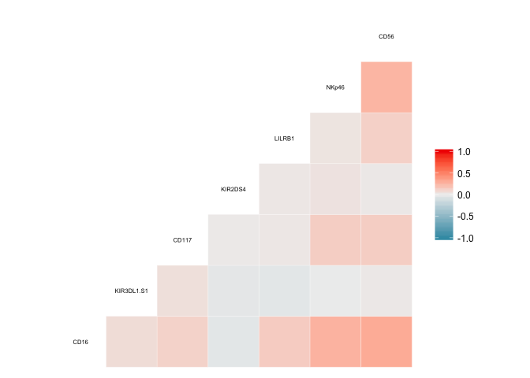
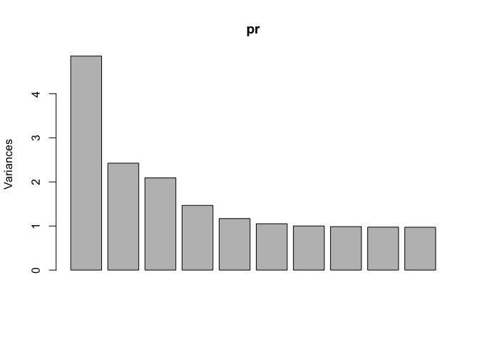
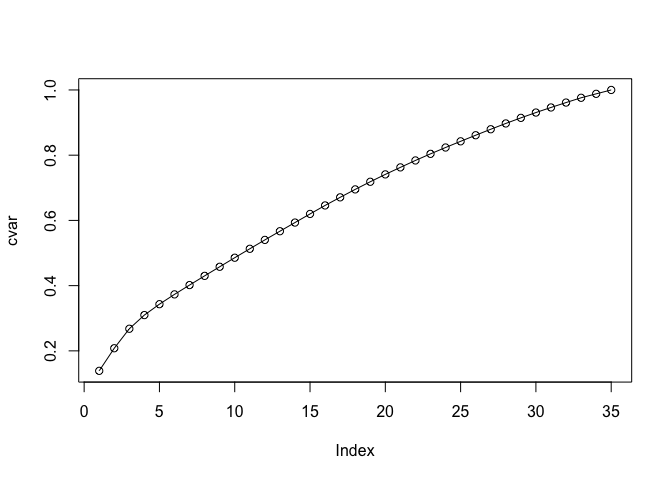
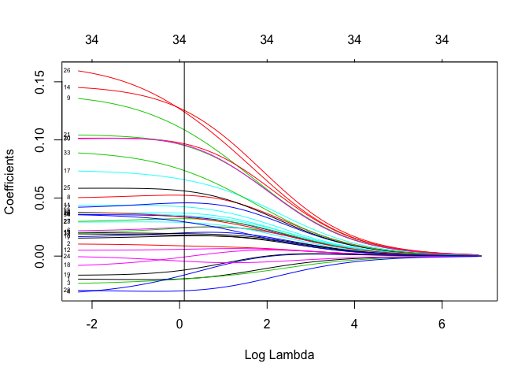
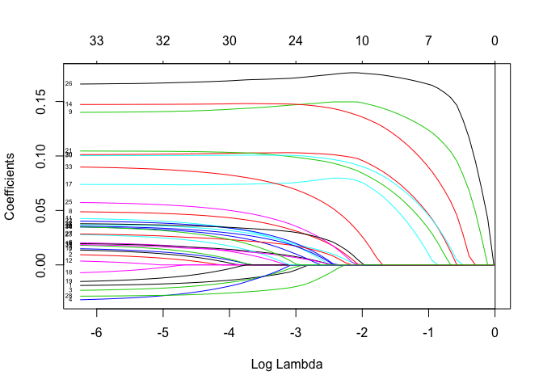
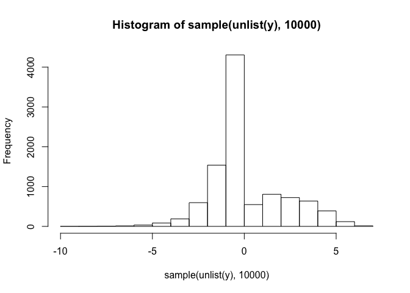
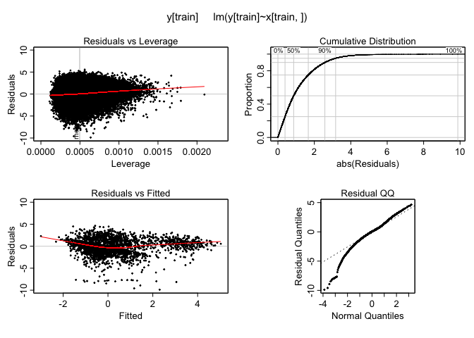
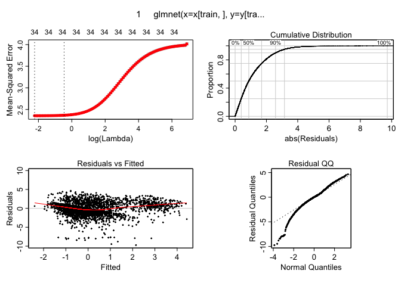
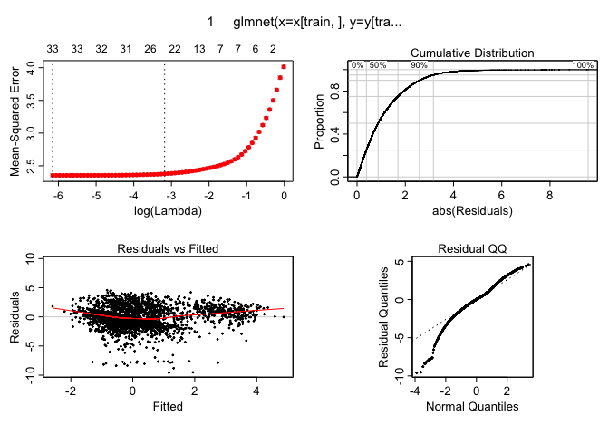

---                                                                         
layout: post
title: "Predicting Protein Expression Level with CyTOF Data and Ridge and LASSO Regression"
author: "R. Tyler McLaughlin"
date: "July 8th, 2018"
categories: blog
---


Project Goals
=============

There is a new biotechnology called [CyTOF](https://en.wikipedia.org/wiki/Mass_cytometry) that produces 40-dimensional data quantifying the expression levels of protein markers on the surface of immune and cancer cells. The recent availability of data this large has motivated the development of new methods for its analysis. Here, I use [ridge](https://en.wikipedia.org/wiki/Tikhonov_regularization) and [LASSO regression](https://en.wikipedia.org/wiki/Lasso_(statistics)) techniques to see if the expression level of one protein can be estimated from the expression levels of the other proteins in the data set. These are the three motivating questions I'm trying to answer:

-   **Can we predict the level of one protein by knowing the level of multiple other proteins?**

-   **If so, how accurately?**

-   **How many other proteins do we need?**

A long term, theoretical question is: What is the minimal set of proteins for predicting the entire 'expression state' of the cell?
In other words, how many proteins do we need to measure simultaneously in order to predict the level of every protein in the cell? With 40 proteins measured per cell, does CyTOF get us close to answering that question?

What is CyTOF?
==============

CyTOF is a state-of-the-art cell analysis technology from [The Nolan lab at Stanford University](http://web.stanford.edu/group/nolan/technologies.html) that allows measurement of the expression levels of 40 different proteins per cell. **CyTOF is a combination of mass spectrometry and flow cytometry.** Compared to light-based flow cytometry, CyTOF doubles the number of proteins per cell that can be measured simultaneously. Instead of using fluorescent molecules to tag proteins as traditional flow cytometry does (which is limited by the distinguishability of different colors of light from the molecules), CyTOF uses a collection of heavy metallic isotopes (like *Europium-151*) with unique **mass-to-charge ratios** to tag proteins.

About the data set
==================

I'm using a publicly available data set from the paper ["Genetic and environmental determinants of human NK cell diversity revealed by mass cytometry"](https://www.ncbi.nlm.nih.gov/pmc/articles/PMC3918221/) by Amir Horowitz et al. This CyTOF dataset consists of data from human [Natural killer cell](https://en.wikipedia.org/wiki/Natural_killer_cell) samples from multiple patients. I'm only going to look at patient \#1. He has ~225,000 cells that have each been labeled with 40 different detectable chemical markers.

I'll refine/pre-process the data and get rid of calibration and extraneous measurements so that we are left with 35 numerical dimensions.

Loading the Data
================

First let's load and attach flow cytometry and data.tables libraries:

``` r
# import essential libraries
library(flowCore,quietly=T,warn.conflicts=F)
library(ggcyto,quietly=T)
library(data.table)
```

If you're following along and executing code, you can either [download the raw data from ImmPort](http://www.immport.org/immport-open/public/study/study/displayStudyDetail/SDY232) yourself (which requires creating an account) and then apply your own filtering as I'm about to show, or you can [skip further down to load my preprocessed data.table](#load).
Here's how I imported the data that I downloaded from ImmPort.

``` r
# load the ImmPort data corresponding to a single human patient
dt1_ <- read.FCS('050112-HNK-001.400899.fcs')
dt1 <- fortify(dt1_)
```

Data Wrangling and Pre-Processing
=================================

Here I filter out dead cells, remove some columns, rename columns, and discard outliers.

``` r
# remove dead cells by removing the top fifth percentile of maleimide-DOTA signal.
dt.filtered <- dt1[`Dead(In115)Dd` < quantile(`Dead(In115)Dd`,.95)]
dt1 <- dt.filtered

# get rid of extraneous data columns
extraneous.ids <- c(1:6,7,17,44,45)
old.names <- attr(dt1,"names")
new.names <- c('CD27','CD19','CD4','CD8','CD57',
       'KIR2DL1-S1','TRAIL','KIR2DL2-L3-S2','CD16',
       'KIR3DL1-S1','CD117','KIR2DS4', 'LILRB1','NKp46',
       'NKG2D','NKG2C','2B4','CD33','CD11b','NKp30',
       'CD122','KIR3DL1','NKp44','CD127','KIR2DL1',
       'CD94','CD34','CCR7','KIR2DL3', 'NKG2A',
       'HLA-DR','KIR2DL4','CD56','KIR2DL5','CD25')
setnames(dt1,old.names[-extraneous.ids],new.names)
dt1 <- dt1[,-extraneous.ids,with=FALSE]

# remove high-expressing outliers
high.cutoff <- quantile(unlist(dt1),0.99)
dt1 <- dt1[rowMeans(dt1<high.cutoff)==1]

# convert to data.table
dt1 <- data.table(dt1)
```

If you were to plot a scatter plot of the data in its current state using any two axes, you'd see a very high density of data points close to the origin in the bottom left corner. This density decreases further away from the origin.

This is called a 'fan' pattern and it suggests that we should do a log transform of the data.

``` r
# do a log transform of the data
# add the minimum value to remove the 0 so we don't get NaNs when we take the log.
# inverse transform would be exp() - min(dt1)
eps <- 0.00001 # for numerical purposes only; we won't take log of a zero value this way
# apply the log transform
dt1 <- log(dt1 - min(dt1) + 0.0001)
```

Finished Wrangling
==================

For added user-friendliness, I've included the pre-processed data in this repository so you can load it using the following:

``` r
load(file = 'CyTOF-data-filtered.Rda')
```

2D Scatter Plots and Spearmann Correlation Matrix
=================================================

Because this data set is 35 dimensional, it is unreasonable to plot all `n*(n-1)/2` 2D scatter plots. I'll just show you a subset:

``` r
subset.dt <- dt1[c(1:1000),c(9:14,33)]
library(GGally)
ggpairs(log(subset.dt))
```


To get a satellite view of the correlative structure of the data, it helps to plot the Spearman correlation matrix.
[Spearman correlation](https://en.wikipedia.org/wiki/Spearman%27s_rank_correlation_coefficient) is just like Pearson correlation but without the assumption of linearity.

``` r
ggcorr(subset.dt,c("pairwise", "spearman"),size = 2)
```



Here's what the full matrix looks like:

``` r
knitr::include_graphics("2018-07-08-Predicting-Protein-Expression-Level-with-CyTOF-Data_files/spearman_correlation_matrix.pdf")
```

<embed src="2018-07-08-Predicting-Protein-Expression-Level-with-CyTOF-Data_files/spearman_correlation_matrix.pdf" width="1000px" height="1000px" type="application/pdf" />
Simple Linear Model
===================

Let's look at what type of R squared value we can get if we build a basic multiple linear regression model for predicting one protein's expression level using the expression levels of the other 34 proteins. CD56, the predicted or 'response' variable, is cell surface protein whose expression level is important during Natural killer cell development. **CD56 will be the response variable that we try to predict for the rest of this study.**

We use the `lm()` function to build a linear model. The notation `CD56~.` defines the regression equation. Since CD56 is to the left of the tilde, this makes it the dependendent variable in the regression equation. The period to the right of the tilde is shorthand for using the remaining columns of the data.table as the predictor variables.

``` r
lm1 <- lm(CD56~.,data = dt1) 
summary(lm1)
```

    ## 
    ## Call:
    ## lm(formula = CD56 ~ ., data = dt1)
    ## 
    ## Residuals:
    ##     Min      1Q  Median      3Q     Max 
    ## -9.8727 -0.8603  0.0340  0.8690  6.0066 
    ## 
    ## Coefficients:
    ##                  Estimate Std. Error t value Pr(>|t|)    
    ## (Intercept)      0.535417   0.012817  41.774  < 2e-16 ***
    ## CD27            -0.015261   0.002472  -6.173 6.72e-10 ***
    ## CD19             0.012218   0.002834   4.312 1.62e-05 ***
    ## CD4             -0.027032   0.002206 -12.254  < 2e-16 ***
    ## CD8             -0.032859   0.002196 -14.964  < 2e-16 ***
    ## CD57             0.039081   0.002320  16.843  < 2e-16 ***
    ## `KIR2DL1-S1`     0.018793   0.003078   6.106 1.02e-09 ***
    ## TRAIL            0.013477   0.003643   3.699 0.000217 ***
    ## `KIR2DL2-L3-S2`  0.048654   0.003136  15.513  < 2e-16 ***
    ## CD16             0.138584   0.002329  59.504  < 2e-16 ***
    ## `KIR3DL1-S1`     0.017632   0.003708   4.755 1.98e-06 ***
    ## CD117            0.042958   0.003257  13.191  < 2e-16 ***
    ## KIR2DS4          0.005137   0.003515   1.461 0.143905    
    ## LILRB1           0.019461   0.002690   7.236 4.65e-13 ***
    ## NKp46            0.143734   0.003004  47.841  < 2e-16 ***
    ## NKG2D            0.018300   0.002616   6.994 2.68e-12 ***
    ## NKG2C            0.033748   0.002860  11.801  < 2e-16 ***
    ## `2B4`            0.074633   0.002635  28.325  < 2e-16 ***
    ## CD33            -0.005951   0.002370  -2.511 0.012033 *  
    ## CD11b           -0.017801   0.002595  -6.859 6.97e-12 ***
    ## NKp30            0.102161   0.002953  34.595  < 2e-16 ***
    ## CD122            0.109025   0.002743  39.750  < 2e-16 ***
    ## KIR3DL1          0.050074   0.003373  14.845  < 2e-16 ***
    ## NKp44            0.032950   0.003619   9.105  < 2e-16 ***
    ## CD127            0.001423   0.002404   0.592 0.553977    
    ## KIR2DL1          0.056634   0.003254  17.403  < 2e-16 ***
    ## CD94             0.164743   0.002668  61.746  < 2e-16 ***
    ## CD34             0.027976   0.002706  10.337  < 2e-16 ***
    ## CCR7            -0.034035   0.002395 -14.214  < 2e-16 ***
    ## KIR2DL3          0.035370   0.003045  11.615  < 2e-16 ***
    ## NKG2A            0.099067   0.002619  37.833  < 2e-16 ***
    ## `HLA-DR`         0.015416   0.002555   6.033 1.61e-09 ***
    ## KIR2DL4          0.045150   0.002912  15.502  < 2e-16 ***
    ## KIR2DL5          0.092036   0.003389  27.161  < 2e-16 ***
    ## CD25             0.029364   0.003404   8.628  < 2e-16 ***
    ## ---
    ## Signif. codes:  0 '***' 0.001 '**' 0.01 '*' 0.05 '.' 0.1 ' ' 1
    ## 
    ## Residual standard error: 1.535 on 140868 degrees of freedom
    ## Multiple R-squared:  0.4131, Adjusted R-squared:  0.4129 
    ## F-statistic:  2916 on 34 and 140868 DF,  p-value: < 2.2e-16

The *F*-statistic *p*-value is very small indicating that the regression slopes are certainly statistically different from zero. This initial model has a multiple R-squared of 0.413087. This isn't bad for what I expected.

Principal Components Analysis
=============================

Principal Components Analysis (PCA) is a good first place to start when working with a high-dimensional data set. Without going into too much detail, PCA tells us about the intrinsic dimensionality of the data.

``` r
# make sure we use scale = TRUE
# so that columns are normalized/whitened
pr <- prcomp(dt1, scale = TRUE)
# plot the principal components
plot(pr)
```



Let's calculate the cumulative sum of variance per eigenvector.

``` r
cvar <- cumsum(pr$sdev^2 / sum(pr$sdev^2))

plot(cvar,type = 'o')
```



``` r
cvar
```

    ##  [1] 0.1387193 0.2080378 0.2678001 0.3097399 0.3431403 0.3731815 0.4017793
    ##  [8] 0.4299526 0.4577986 0.4855800 0.5129362 0.5401750 0.5668659 0.5933827
    ## [15] 0.6198031 0.6459105 0.6707260 0.6951041 0.7184752 0.7411216 0.7625982
    ## [22] 0.7838409 0.8040867 0.8235402 0.8425114 0.8611602 0.8795169 0.8972915
    ## [29] 0.9144050 0.9307292 0.9463017 0.9613498 0.9760026 0.9880973 1.0000000

Because this analysis shows we need at least 29 principal components to capture 90% of the variance of the data set, this means using dimensionality reduction methods probably shouldn't be advised. As such, techniques like Principal Components Regression probably won't work so well because the data is intrinsically very high-dimensional.

Splitting Data into Training and Test Sets
==========================================

Let's use the `model matrix` data structure so we can easily apply several types of linear models.

``` r
x = model.matrix(CD56~., dt1)[,-1]
y = dt1$CD56
```

Randomly split the data 50/50 into training and test sets:

``` r
set.seed(1) # so your random numbers are identical to mine.
# the training set is a random 50% of the data
train <- sample(1:nrow(x),nrow(x)*.50)
# the test set is the set of indices not in the train set.
test <- -train
y.test = y[test]
```

Building ridge and LASSO regression models
==========================================

Ridge and LASSO models are useful mainly because they are less prone to overfitting data when compared to multiple linear regression models that are fit using least-squares. In other words, these methods reduce the test error, which makes them better for predictive modeling.

Ridge and LASSO regression techniques both take a tuning parameter called "lambda" that controls the degree of regularization aka "shrinkage." A large value of lambda will force the regression weights to be small. In the case of LASSO regression, lambda will force a subset of the weights to be exactly zero.

Let's make a logarithmic grid from which we will select lambda values to parametrize the ridge and LASSO regression models.

``` r
# smart way to make a "log space"
grid = 10^seq(10,-2,length=100)
```

Let's import the glmnet package and build our ridge and LASSO models using the training set.

``` r
library(glmnet,quietly=T)
```

    ## 
    ## Attaching package: 'Matrix'

    ## The following object is masked from 'package:flowCore':
    ## 
    ##     %&%

    ## Loaded glmnet 2.0-16

``` r
# Setting alpha = 0 builds a ridge regression model.
ridge.model <-  glmnet(x[train,],y[train],alpha=0,lambda = grid)
# alpha = 1 is for lasso regression
lasso.model <- glmnet(x[train,],y[train],alpha=1,lambda = grid)
```

These methods standardize the data by default.

In order to estimate the optimal value of lambda to use for each of the two models, we use 5-fold cross-validation on the training set. The `cv.glmnet` function is used for both the ridge and LASSO.

``` r
ridge.cv.out <- cv.glmnet(x[train,],y[train],alpha=0,nfolds = 5)
ridge.best.lambda <- min(ridge.cv.out$lambda.min)
lasso.cv.out <- cv.glmnet(x[train,],y[train],alpha=1,nfolds = 5)
lasso.best.lambda <- min(lasso.cv.out$lambda.min)
```

For each of the two models, we calculated a deviance value associated with each of the lambda values in our grid. The best value of lambda is model dependent and is the one with the lowest deviance.

Let's plot the weights of the ridge and LASSO regression models as a function of lambda.

``` r
plot(ridge.cv.out$glmnet.fit, "lambda", label=TRUE) 
abline(v = ridge.best.lambda, col = "black")
```



``` r
ridge.best.lambda
```

    ## [1] 0.1078993

``` r
plot(lasso.cv.out$glmnet.fit, "lambda", label=TRUE) 
abline(v = lasso.best.lambda, col = "black")
```



``` r
lasso.best.lambda
```

    ## [1] 0.002118107

For both of these models, the optimal lambda is small--very close to zero (marked by the black line). This means regularization is not being applied heavily and the weights in the models are not too different from those obtained using ordinary least-squares. We will eventually see that a little bit of regularization goes a long way.

Making Predictions
==================

For ridge regression, let's use the lambda associated with the lowest deviance to make a **prediction** of the CD56 level in the test set using the 34 predictor columns in the test set. I'm using the root mean square-error (RMSE) for a quantification of the average accuracy of the prediction.

``` r
ridge.prediction <- predict(ridge.model, s=ridge.best.lambda, newx = x[test,])
ridge.RMSE <- sqrt(mean((ridge.prediction - y.test)^2))
```

Let's do the same for LASSO regression:

``` r
lasso.prediction <- predict(lasso.model, s=lasso.best.lambda, newx = x[test,])
lasso.RMSE <- sqrt(mean((lasso.prediction - y.test)^2))
```

Before we look at the RMSE numbers to assess the quality of the model fits, we should also construct a basic, least-squares multiple linear regression model for comparing to ridge and LASSO.

``` r
basic.lm <- lm(y[train] ~ x[train,])
basic.prediction <- predict(basic.lm, newx = x[test,])
basic.lm.RMSE <- sqrt(mean((basic.prediction - y.test)^2))
```

Let's also make a trivial linear model for comparing to our other regression models.

My trivial linear model is fitting the data to a line y = 1.

``` r
trivial.lm <- lm(y[train] ~ 1)
trivial.prediction <- predict(trivial.lm, newx = x[test,])
trivial.lm.RMSE <- sqrt(mean((trivial.prediction - y.test)^2))
```

Model results
=============

Here are the RMSE values for all four regression models.

``` r
trivial.lm.RMSE
```

    ## [1] 2.001825

``` r
basic.lm.RMSE
```

    ## [1] 2.381332

``` r
ridge.RMSE
```

    ## [1] 1.535721

``` r
lasso.RMSE
```

    ## [1] 1.536237

The fact that the trivial model has a lower test error suggests that least-squares multiple linear regression model is overfitting the data. Calculating the training error of the least-squares model and seeing that it is in fact much lower than the test error confirms this suspicion.

``` r
basic.train.prediction <- predict(basic.lm, newx = x[train,])
basic.lm.train.RMSE <- sqrt(mean((basic.prediction - y[train])^2))
basic.lm.train.RMSE
```

    ## [1] 1.533577

Ridge and LASSO, which have about the same test RMSE, have substantially lower test error than compared to both the trivial and basic linear regression models. This means that these so called "shrinkage methods" are not overfitting (regularization is working) and they provide a true predictive advantage.... Which was what we wanted, wasn't it?

Well, not quite. We also need to compare the RMSE values to the scale and statistics of the response variable, CD56. Otherwise we can't really say how good our model prediction is.

First let's look at a histogram of CD56 values:

``` r
# subsampling so we don't plot every data point
hist(sample(unlist(y),10000))
```

 It looks like CD56 ranges between -5 and 5. (Remember we did a a log transform during the preprocessing phase.) Let's quantify the mean and standard deviation.

``` r
mean(unlist(y))
```

    ## [1] 0.136993

``` r
sd(unlist(y))
```

    ## [1] 2.002855

With an RMSE of about 1.535721,it looks like our ridge model makes predictions within about 0.7667659 of one standard deviation. This is pretty OK!

One last thing, let's check to make sure the model works well regardless of the expression level of the response variable CD56. I'll plot the *residuals* versus the *fitted values* using the 'plotmo' package.

For least-squares linear regression:

``` r
library(plotmo,quietly=T)
plotres(basic.lm)
```



For ridge regression:

``` r
plotres(ridge.cv.out)
```



And lastly for the LASSO fit:

``` r
plotres(lasso.cv.out)
```



These plots indiate there are no dramatic non-linearities present in the data. This suggests that using linear models seems to be an ok way to make predictions and that there is no need to use more flexible versions of these tools like polynomial regression or splines for a task like this. It is worth mentioning that **the logarithmic transform** during the pre-preprocessing stage **was essential** as otherwise these *residuals vs fitted values* plots look much less well-behaved.

Conclusions
===========

In this project, I applied several regression techniques to CyTOF data and evaluated their suitability for predicting protein expression at the single cell level. Let's see if I answered the motivating questions of the project.

-   **Can we predict the level of one protein by knowing the level of multiple other proteins?**

The LASSO and ridge models applied to 34 protein levels from the CyTOF data set indeed offer a moderate ability to predict the level of the one protein I investigated (CD56), with an RMSE which is about 25% less than one standard deviation of the sample mean.

-   **How accurately?**

Ideally, I would like to have prediction accuracy within a small fraction of the sample standard deviation. The high RMSE relative to the scale of CD56 variablitiy means that measuring the expression level of these 34 proteins per cell is not sufficient to infer the expression level of CD56. This suggests that there are other factors involved in the regulation of CD56 expression and most of the proteins in the data set are unrelated to CD56 expression level.
For a stronger biological conclusion of this study, it appears that these 34 proteins are not closely associated with the CD56 regulatory pathway.
Measuring proteins more directly associated with regulation of CD56 would certainly lead to a better predictive model.

-   **How many other proteins do we need?**

The cell is a complex network of thousands of interacting proteins. In this light, it is promising that I was able to build predictive ridge and LASSO regression models using only the 34 predictor variables available in the data set.
While my project does not answer how many proteins we need to accurately predict the level of CD56, perhaps a more prudently chosen set of 34 proteins would yield strong prediction ability so that we get an RMSE within a tiny fraction of the sample standard deviation.
Alternatively, we may need several hundreds of proteins to be measured simultaneously to predict the level of any one protein. If this is true, then CyTOF technology is simply not good enough and we may need to wait decades before we can answer questions like this.

Optimistically, perhaps using other powerful methods, like random forests or deep learning, would work better with the same data. I am excited to test out these methods on CyTOF data in the near future! Thanks for reading, and if you followed along with your own data or protein marker, please let me know!

References
==========

-   James, G., Witten, D., Hastie, T. and Tibshirani, R., 2013. An introduction to statistical learning (Vol. 112). New York: springer.

-   Horowitz, A., Strauss-Albee, D.M., Leipold, M., Kubo, J., Nemat-Gorgani, N., Dogan, O.C., Dekker, C.L., Mackey, S., Maecker, H., Swan, G.E. and Davis, M.M., 2013. Genetic and environmental determinants of human NK cell diversity revealed by mass cytometry. Science translational medicine, 5(208), pp.208ra145-208ra145.

-   Newell, E.W. and Cheng, Y., 2016. Mass cytometry: blessed with the curse of dimensionality. Nature immunology, 17(8), p.890.
